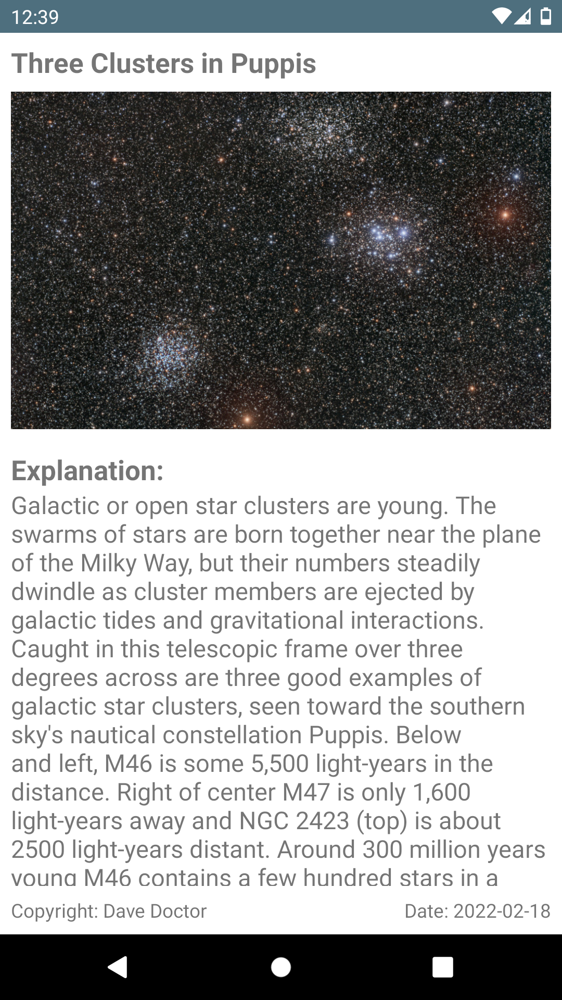

## Astronomy Picture of the Day

It show an astronomical picture of the day from [Nasa Apod API](https://apod.nasa.gov/apod/astropix.html).
#### In this project I have used,
* Data binding
* Glide
* Coroutines
* Room Database to implement Offline Cache
* Work Manager
* MVVM

##### Screenshots

 

